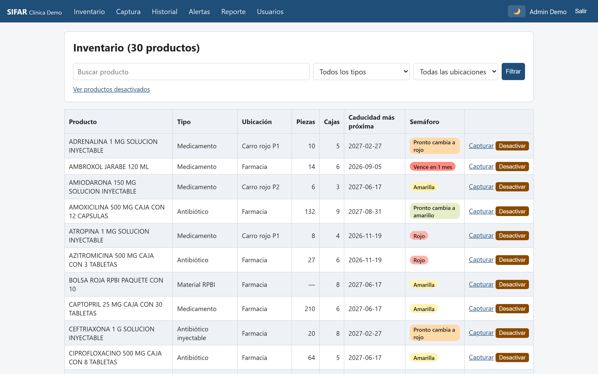
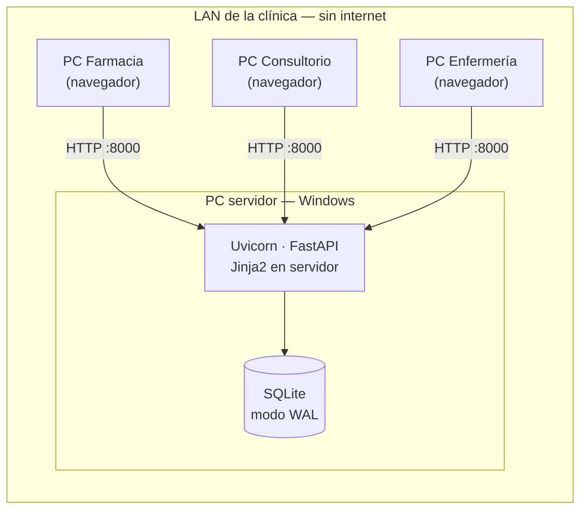
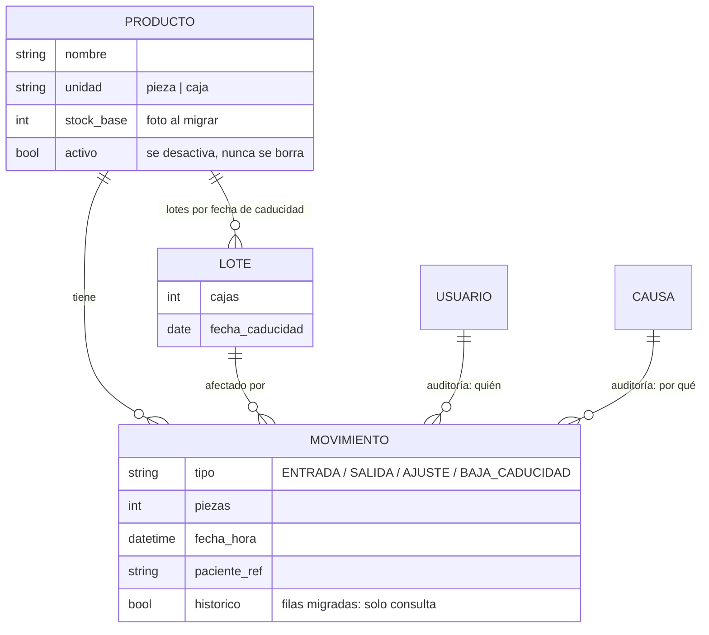
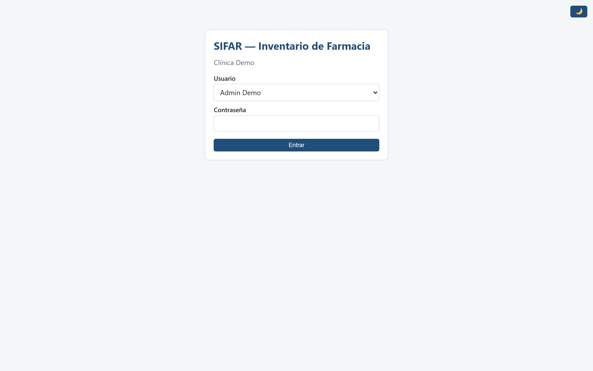
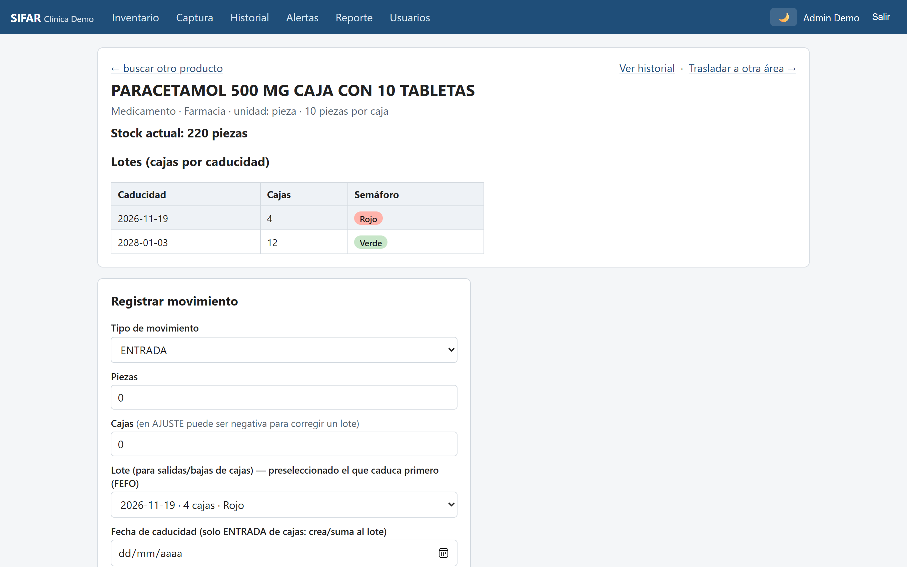
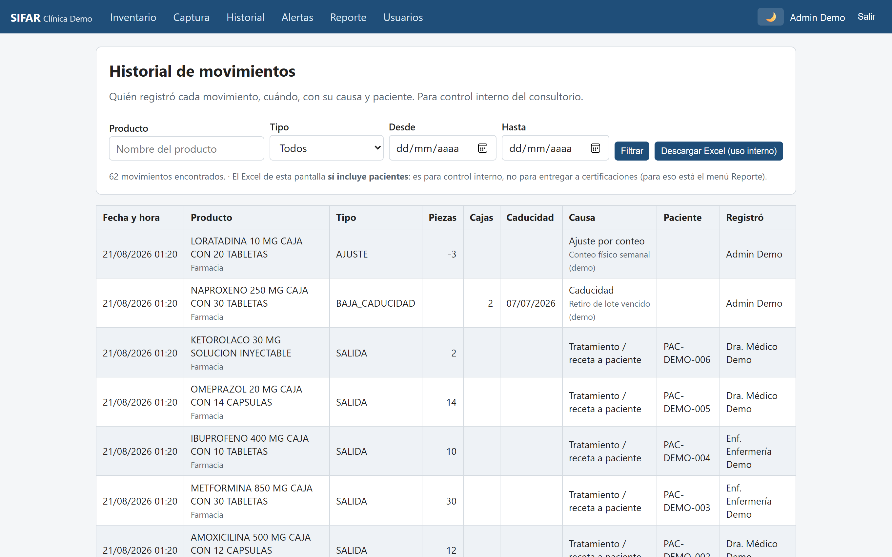
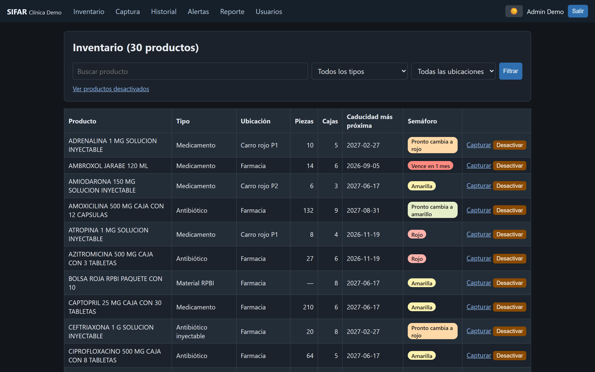

# SIFAR — Sistema de Inventario de Farmacia

**[English](README.md) · Español**


Aplicación web de inventario de farmacia construida para una clínica real de primer nivel, **en producción sobre su red local desde julio de 2026**, usada a diario por personal médico no técnico. Reemplazó un libro de Excel con macros que dejaron de funcionar: un solo editor, contraseñas en texto plano, un archivo nuevo hecho a mano cada mes y ningún registro de quién movía qué.

> Este repositorio es una **copia sanitizada del código de producción**. La identidad de la institución, los usuarios reales y los datos de la clínica se reemplazaron por valores demo; la ingeniería está intacta. Todo lo visible en las capturas son datos de demostración generados.

**▶ Demo en vivo:** [sifar-demo.azurewebsites.net](https://sifar-demo.azurewebsites.net) — entra como `Admin Demo` / `demo1234`. El arranque en frío del tier gratuito puede tardar ~1 min, y la base de datos se re-siembra sola en cada reinicio ([cómo está desplegada](docs/deploy_azure.md)).



## El problema

La clínica operaba toda su farmacia en un solo archivo `.xlsm`:

- Las macros estaban rotas, así que el "sistema" eran celdas editadas a mano.
- Un Excel compartido permite **un editor a la vez** — los demás esperaban.
- El stock se cerraba **a mano en un libro nuevo cada mes**.
- Las contraseñas vivían en texto plano dentro de la propia hoja.
- Sin rastro de auditoría: nadie podía saber quién movió qué, cuándo ni por qué.
- **245 lotes caducos** estaban sin detectar en el inventario (afloraron en la migración).

## La solución

Una app web renderizada en servidor sobre la LAN de la clínica — una sola base de datos compartida, usuarios simultáneos, rastro de auditoría completo y un stock que **se deriva de los movimientos, nunca se teclea**:

- **Semáforo de caducidad** por lote, con umbrales definidos por la clínica, y **FEFO**: en cada salida la app sugiere el lote que caduca primero.
- **Captura multiusuario** con quién/cuándo/por qué automático en cada movimiento.
- **Reporte por periodo a Excel sin datos de pacientes** (para auditorías de certificación) más bitácora interna con ellos.
- Alta de productos con permiso individual por usuario; los productos **se desactivan, nunca se borran**.
- **Traslados atómicos** entre áreas, reset de inventario auditado todo-o-nada y actualización incremental del catálogo desde Excel con vista previa.
- **Cambio de contraseña forzado** en el primer inicio de sesión y **cierre por inactividad** aplicado en servidor y navegador.
- Tema claro/oscuro, acceso directo de escritorio e **instalación 100 % sin internet** (la clínica no tiene conexión confiable).

## Arquitectura

Todo el diseño responde a una restricción: **una clínica sin área de sistemas**. El sistema debe correr en una PC Windows disponible, respaldarse copiando un solo archivo y seguir funcionando el día que no haya nadie técnico presente.

| Capa | Elección | Por qué |
|---|---|---|
| Backend | FastAPI (Python 3.12) | Los formularios se validan en la frontera, antes de tocar la base |
| Base de datos | SQLite en modo WAL | Los lectores no bloquean al escritor — suficiente para una farmacia de 10–15 personas sin servidor de BD; respaldar = copiar un archivo |
| Acceso a datos | SQLAlchemy | PostgreSQL queda a una cadena de conexión de distancia si la clínica crece |
| Interfaz | Jinja2, renderizado en servidor | Sin framework de JS, sin build, sin CDN — se despliega a una PC sin internet como archivos planos |
| Contraseñas | bcrypt | Hash deliberadamente lento; el antecesor las guardaba en texto plano |
| Migración | openpyxl | 576 productos y su historial completo importados sin recapturar una sola fila |



Modelo de datos simplificado — la tabla de movimientos es **solo-agregar**, y el stock actual siempre es `stock_base + Σ(movimientos)`:



## Impacto

Solo afirmaciones verificables — sin porcentajes inventados:

- **Eliminó el libro mensual hecho a mano**: el stock se calcula, así que no hay nada que "cerrar".
- De **un editor de Excel** a captura multiusuario simultánea sobre el mismo dato.
- Cada movimiento registra **quién, cuándo, causa y referencia de paciente** — la farmacia se volvió auditable.
- **576 productos y su historial completo de movimientos** migrados automáticamente desde Excel; **245 lotes caducos** detectados en el proceso.
- Las contraseñas pasaron de texto plano en una hoja a **hashes bcrypt con rotación forzada** más cierre por inactividad.
- **18 criterios de aceptación** verificados de extremo a extremo antes del despliegue.
- En producción desde **julio de 2026**, iterando sobre retroalimentación de uso real diario.

## Decisiones de ingeniería

1. **El stock se deriva, nunca se almacena.** `stock = stock_base + Σ(movimientos)` — el principio de la contabilidad de doble entrada / event sourcing. Hace estructuralmente imposible una contradicción entre stock e historial, y es lo que mató el ritual del cierre mensual ([`app/services.py`](app/services.py)).

2. **Concurrencia sin servidor de base de datos.** SQLite WAL + `busy_timeout`, y la ruta de escritura **inserta antes de validar**: el INSERT adquiere el candado de escritura de SQLite y serializa las capturas concurrentes. Validar primero sería una carrera check-then-act — dos salidas simultáneas podrían pasar ambas el chequeo de stock. Verificado con 20 escrituras paralelas desde dos sesiones ([`app/services.py`](app/services.py), [`scripts/test_concurrencia.py`](scripts/test_concurrencia.py)).

3. **Las operaciones de varios pasos van en una transacción.** Un traslado entre áreas registra la salida y la entrada atómicamente — una interrupción nunca puede dejar stock varado entre áreas ([`app/services.py`](app/services.py)). El reset de inventario auditado corre como una sola transacción sin savepoints, tras descubrir que el driver pysqlite confirma en los límites de SAVEPOINT ([`app/reset_stock.py`](app/reset_stock.py), nota en [`app/db.py`](app/db.py)).

4. **Seguridad en dos capas.** El cierre por inactividad se aplica en el servidor (la garantía) y se refleja en el navegador (el aviso y la redirección lejos de los datos de pacientes). Invalidar una sesión solo a la vista no protege nada ([`app/auth.py`](app/auth.py), [`app/templates/base.html`](app/templates/base.html)).

5. **Código y datos nunca viajan juntos.** Las actualizaciones reemplazan código, nunca la base de datos. Los paquetes de despliegue los arma un script de lista de inclusión — solo viaja lo listado, así nada sensible se filtra por omisión — y los respaldos seguros con WAL usan `VACUUM INTO` ([`app/respaldo.py`](app/respaldo.py)).

6. **Nunca borrar.** Usuarios y productos se desactivan, no se eliminan; la bitácora de movimientos es inmutable. Esa es la propiedad que hace auditable al sistema ([`app/models.py`](app/models.py)).

7. **El input hostil se neutraliza en las fronteras.** Los exports a Excel escapan la inyección de fórmulas (OWASP CSV/formula injection) en cada celda de texto libre — las referencias de paciente y los nombres de producto son input de usuario ([`app/services.py`](app/services.py), `texto_excel`).

8. **Migraciones de esquema sobre una BD de producción que no se puede borrar.** `create_all()` de SQLAlchemy crea tablas que falten pero nunca agrega columnas, así que el arranque aplica pasos `ALTER TABLE` explícitos para los campos nuevos ([`app/main.py`](app/main.py)).

## Capturas

Todos los datos mostrados son de demostración (`app/demo_data.py`).

| | |
|---|---|
|  |  |
| Login con rotación forzada al primer acceso | Captura con sugerencia de lote FEFO |
|  |  |
| Historial auditable: quién, cuándo, por qué | Tema oscuro, recordado por navegador |

## Levantar la demo

```powershell
git clone https://github.com/JoshuaEngine7/sifar-inventario-farmacia.git
cd sifar-inventario-farmacia
python -m venv .venv
.venv\Scripts\python -m pip install -r requirements.txt
.venv\Scripts\python -m app.demo_data
.venv\Scripts\python -m uvicorn app.main:app --port 8000
```

Abre `http://127.0.0.1:8000` y entra como `Admin Demo` / `demo1234` — la app obliga a definir una contraseña nueva, exactamente como en producción. `demo_data` siembra ~30 productos genéricos con caducidades **relativas a hoy**, así el semáforo siempre muestra todos sus estados, incluidos lotes vencidos.

Opcional — la prueba de concurrencia usada antes del despliegue (20 escrituras paralelas, 2 sesiones, el stock nunca debe quedar negativo):

```powershell
.venv\Scripts\python scripts\test_concurrencia.py --password <tu-nueva-contraseña> --n 20 --tipo SALIDA
```

## Licencia

MIT — ver [LICENSE](LICENSE).

---

Construido y desplegado por [JoshuaEngine7](https://github.com/JoshuaEngine7). Este es un caso de estudio de un sistema real en producción; todos los nombres, credenciales y datos de este repositorio son valores de demostración.
