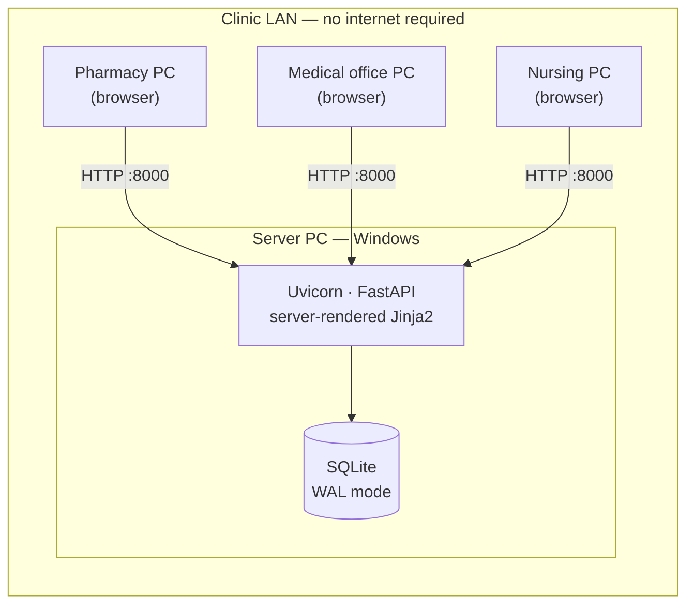
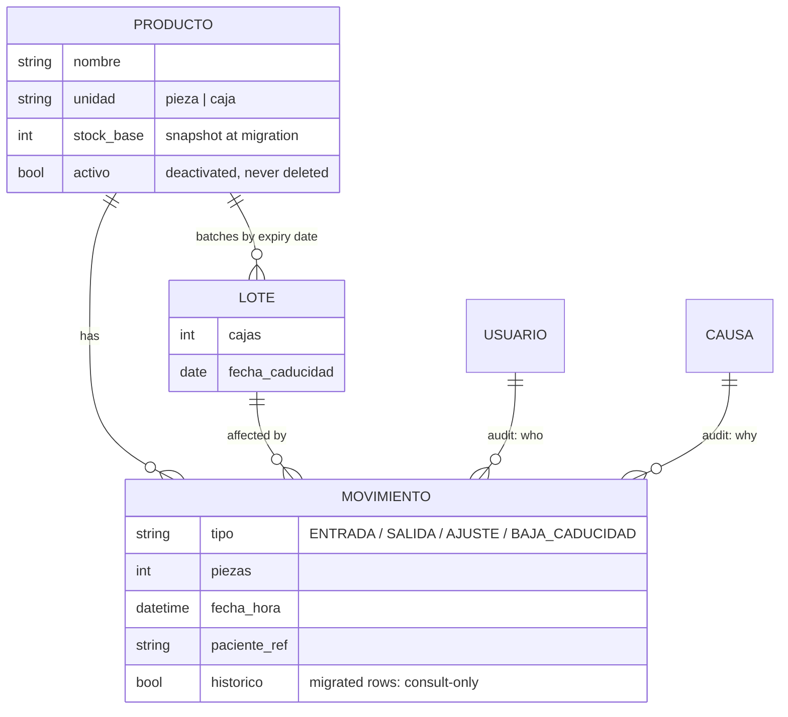

# SIFAR — Pharmacy Inventory System

**English · [Español](README.es.md)**


A pharmacy inventory web application built for a real primary-care clinic and **in production on its local network since July 2026**, used daily by non-technical medical staff. It replaced a macro-driven Excel workbook that had stopped working: single editor, plaintext passwords, a new file rebuilt by hand every month, and no record of who moved what.

> This repository is a **sanitized copy of the production code**. Institution identity, real users and clinic data were replaced with demo values; the engineering is unchanged. Everything visible in the screenshots is generated demo data.

**▶ Live demo:** [sifar-demo.azurewebsites.net](https://sifar-demo.azurewebsites.net) — sign in as `Admin Demo` / `demo1234`. Free-tier cold start can take ~1 min, and the database re-seeds itself on every restart ([how it's deployed](docs/deploy_azure.md)).


## The problem

The clinic ran its entire pharmacy on one `.xlsm` file:

- The macros were broken, so the "system" was hand-edited cells.
- A shared Excel file allows **one editor at a time** — everyone else waited.
- Stock was closed out **by hand into a new workbook every month**.
- Passwords were stored in plaintext inside the sheet.
- No audit trail: nobody could tell who moved what, when, or why.
- **245 expired lots** were sitting undetected in inventory (surfaced during migration).

## The solution

A server-rendered web app on the clinic's LAN — one shared database, simultaneous users, a complete audit trail, and stock that is **derived from movements, never typed**:

- **Expiry traffic-light** per lot, with thresholds defined by the clinic, and **FEFO**: on every withdrawal the app suggests the lot that expires first.
- **Multi-user capture** with automatic who/when/why on every movement.
- **Per-period Excel report without patient data** (for certification audits) plus an internal log with it.
- Product creation gated by per-user permission; products **deactivate, never delete**.
- **Atomic transfers** between areas, an audited all-or-nothing inventory reset, and incremental catalog updates from Excel with preview.
- **Forced password rotation** on first login and **inactivity logout** enforced on both server and browser.
- Light/dark theme, desktop shortcut, **fully offline installation** (the clinic has no reliable internet).

## Architecture

The whole design answers one constraint: **a clinic with no IT department**. The system must run on a spare Windows PC, be backed up by copying a single file, and keep working the day nobody technical is around.

| Layer | Choice | Why |
|---|---|---|
| Backend | FastAPI (Python 3.12) | Form data is validated at the border, before touching the database |
| Database | SQLite in WAL mode | Readers never block the writer — enough for a 10–15 person pharmacy with no database server; backup = copy one file |
| Data access | SQLAlchemy | PostgreSQL stays one connection-string away if the clinic ever outgrows SQLite |
| UI | Jinja2, server-rendered | No JS framework, no build step, no CDN — deployable to an offline PC as plain files |
| Passwords | bcrypt | Deliberately slow hashing; the predecessor stored passwords in plaintext |
| Migration | openpyxl | 576 products and their full history imported without retyping a single row |



Simplified data model — the movements table is **append-only**, and current stock is always `stock_base + Σ(movements)`:



## Impact

Only verifiable claims — no invented percentages:

- **Eliminated the monthly hand-built workbook**: stock is computed, so there is nothing to "close out".
- From **one Excel editor** to simultaneous multi-user capture on the same data.
- Every movement records **who, when, cause and patient reference** — the pharmacy became auditable.
- **576 products and their complete movement history** migrated automatically from Excel; **245 expired lots** detected in the process.
- Passwords went from plaintext in a spreadsheet to **bcrypt hashes with forced rotation** plus inactivity logout.
- **18 acceptance criteria** verified end-to-end before deployment.
- In production since **July 2026**, iterating on feedback from real daily use.

## Engineering decisions

1. **Stock is derived, never stored.** `stock = stock_base + Σ(movements)` — the double-entry bookkeeping / event-sourcing principle. It makes a contradiction between stock and history structurally impossible, and it is what killed the monthly closing ritual ([`app/services.py`](app/services.py)).

2. **Concurrency without a database server.** SQLite WAL + `busy_timeout`, and the write path **inserts before validating**: the INSERT acquires SQLite's write lock and serializes concurrent captures. Validating first would be a check-then-act race — two simultaneous withdrawals could both pass the stock check. Verified with 20 parallel writes from two sessions ([`app/services.py`](app/services.py), [`scripts/test_concurrencia.py`](scripts/test_concurrencia.py)).

3. **Multi-step operations are one transaction.** A transfer between areas records the exit and the entry atomically — an interruption can never strand stock between areas ([`app/services.py`](app/services.py)). The audited inventory reset runs as a single transaction with no savepoints, after discovering that the pysqlite driver commits on SAVEPOINT boundaries ([`app/reset_stock.py`](app/reset_stock.py), note in [`app/db.py`](app/db.py)).

4. **Security in two layers.** Inactivity logout is enforced server-side (the guarantee) and mirrored in the browser (the warning and the redirect away from patient data). Invalidating a session only visually protects nothing ([`app/auth.py`](app/auth.py), [`app/templates/base.html`](app/templates/base.html)).

5. **Code and data never travel together.** Updates replace code, never the database. Deployment packages are built by an allowlist script — only what is listed ships, so nothing sensitive leaks by omission — and WAL-safe backups use `VACUUM INTO` ([`app/respaldo.py`](app/respaldo.py)).

6. **Never delete.** Users and products are deactivated, never removed; the movement log is immutable. That is the property that makes the system auditable ([`app/models.py`](app/models.py)).

7. **Hostile input is neutralized at the borders.** Excel exports escape formula injection (OWASP CSV/formula injection) on every free-text cell — patient references and product names are user input ([`app/services.py`](app/services.py), `texto_excel`).

8. **Schema migrations on a production DB that cannot be dropped.** SQLAlchemy's `create_all()` adds missing tables but never columns, so startup applies explicit `ALTER TABLE` steps for new fields ([`app/main.py`](app/main.py)).

## Screenshots

All data shown is demo data (`app/demo_data.py`).

| | |
|---|---|
|  |  |
| Login with forced first-login rotation | Capture with FEFO lot suggestion |
|  |  |
| Auditable history: who, when, why | Dark theme, remembered per browser |

## Run the demo

```powershell
git clone https://github.com/JoshuaEngine7/sifar-inventario-farmacia.git
cd sifar-inventario-farmacia
python -m venv .venv
.venv\Scripts\python -m pip install -r requirements.txt
.venv\Scripts\python -m app.demo_data
.venv\Scripts\python -m uvicorn app.main:app --port 8000
```

Open `http://127.0.0.1:8000` and sign in as `Admin Demo` / `demo1234` — the app forces you to set a new password, exactly like production. `demo_data` seeds ~30 generic products with expiry dates **relative to today**, so the traffic-light always shows every state, including expired lots.

Optional — the concurrency check used before deployment (20 parallel writes, 2 sessions, stock must never go negative):

```powershell
.venv\Scripts\python scripts\test_concurrencia.py --password <your-new-password> --n 20 --tipo SALIDA
```

## License

MIT — see [LICENSE](LICENSE).

---

Built and deployed by [JoshuaEngine7](https://github.com/JoshuaEngine7). This is a case study of a real production system; every name, credential and data point in this repository is a demo value.
